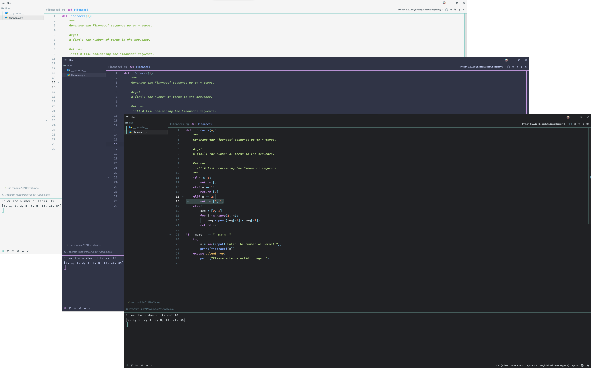
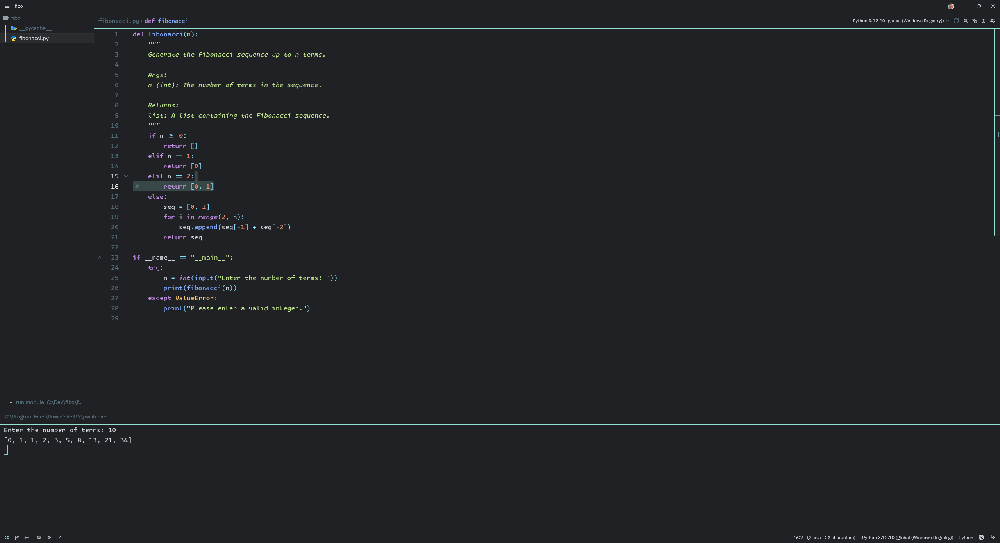
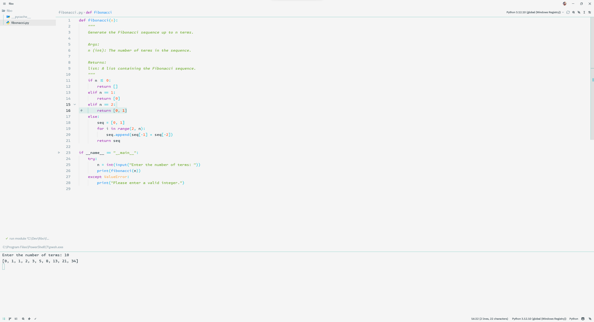
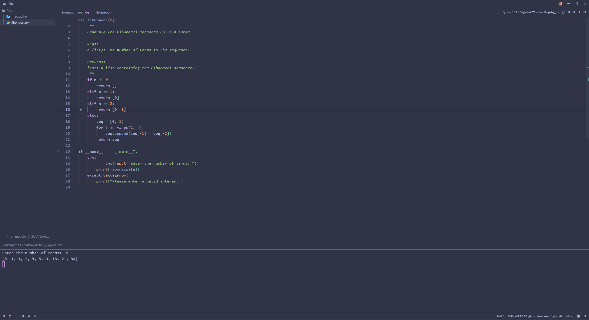

	

# Flat Theme for Zed

A clean, minimalist theme collection for [Zed](https://zed.dev) based on the popular Flat Theme for VSCode, featuring three beautiful variants.

## Themes Included

### Flat Gray (Dark)
The original dark theme with a sleek gray background and teal accents.

    

### Flat Light
A bright, clean light theme perfect for daytime coding.

    

### Flat Frappé (Dark)
Inspired by Catppuccin Frappé, featuring softer, pastel colors for reduced eye strain.

    

## Features

- **Three Beautiful Variants**: Choose between dark gray, light, or Frappé aesthetics
- **Consistent Color Scheme**: Terminal colors match the rest of the IDE in all variants
- **Clean Flat Design**: Minimal borders for a sleek, modern look - one clean slate of color
- **Subtle Accents**: Each theme has its signature accent color for visual feedback
- **Highlighted Borders**: Important UI elements like hover messages, errors, and warnings have distinct colored borders
- **Clear Syntax Highlighting**: Well-balanced color palettes optimized for code readability

## Color Palettes

### Flat Gray (Dark)
- **Background**: `#202124` - Dark gray
- **Foreground**: `#CFD8DC` - Light gray
- **Accent**: `#94E2D5` - Teal/Cyan
- **Keywords**: `#C792EA` - Purple
- **Functions**: `#82AAFF` - Blue
- **Strings**: `#C3E88D` - Green
- **Numbers**: `#F78C6C` - Orange
- **Comments**: `#546E7A` - Muted gray

### Flat Light
- **Background**: `#F5F5F5` - Light gray
- **Foreground**: `#37474F` - Dark gray
- **Accent**: `#80CBC4` - Teal
- **Keywords**: `#AB47BC` - Purple
- **Functions**: `#42A5F5` - Blue
- **Strings**: `#7CB342` - Green
- **Numbers**: `#FF7043` - Orange
- **Comments**: `#90A4AE` - Muted gray

### Flat Frappé (Dark)
- **Background**: `#303446` - Soft dark blue-gray
- **Foreground**: `#c6d0f5` - Soft white
- **Accent**: `#ca9ee6` - Mauve/Purple
- **Keywords**: `#ca9ee6` - Mauve
- **Functions**: `#8caaee` - Blue
- **Strings**: `#a6d189` - Green
- **Numbers**: `#ef9f76` - Peach
- **Comments**: `#838ba7` - Muted blue-gray

## Installation

### From Zed Extensions

1. Open Zed
2. Press `Cmd+Shift+P` (macOS) or `Ctrl+Shift+P` (Linux/Windows)
3. Type "extensions" and select "zed: extensions"
4. Search for "Flat Theme"
5. Click "Install"

### Manual Installation

1. Clone this repository or download the files
2. In the zed extensions page, select install dev extension
3. Select the folder where you cloned/downloaded the theme
4. Go to Settings → Theme and select your preferred variant:
   - "Flat Gray" (dark)
   - "Flat Light" (light)
   - "Flat Frappé" (dark, pastel)

## What Makes This Different?

These themes address common issues found in other themes:

1. **Terminal Consistency**: Unlike some themes that leave terminal colors undefined, all Flat Theme variants ensure your terminal matches your editor for a unified experience across all three themes.

2. **Smart Borders**: Inspired by Catppuccin, all variants feature colored borders on hover messages, errors, warnings, and info popups that make them instantly recognizable.

3. **No Visual Clutter**: Following the Material Theme Darker philosophy, all UI borders are transparent. Each theme is truly one clean slate of color, letting your code take center stage.

4. **Multiple Aesthetics**: Choose the theme that matches your environment and preference:
   - **Flat Gray**: Classic dark theme with high contrast
   - **Flat Light**: Perfect for bright environments
   - **Flat Frappé**: Softer, easier on the eyes for extended coding sessions

## Contributing

Contributions are welcome! Please feel free to submit a Pull Request.

## License

MIT License

## Credits

- Inspired by [Flat Theme for VSCode](https://marketplace.visualstudio.com/items?itemName=gerane.Theme-FlatGray)
- Border design inspired by [Catppuccin](https://github.com/catppuccin/zed)
- UI philosophy influenced by [Material Theme](https://github.com/material-theme/vsc-material-theme)

## Feedback

If you have suggestions or find issues, please open an issue on GitHub.

---

**Enjoy coding with Flat Theme!** 🎨
