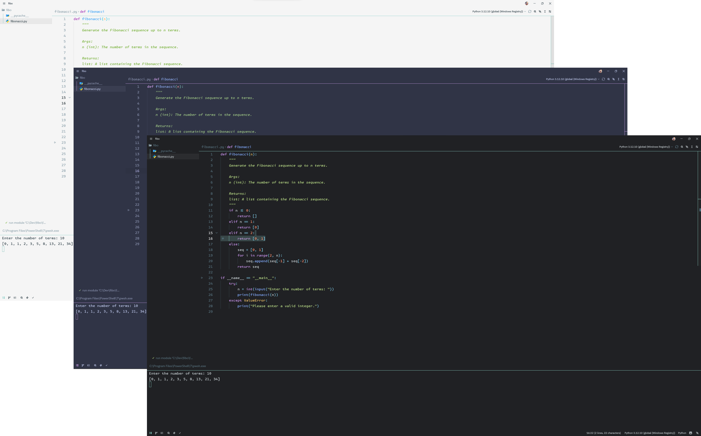
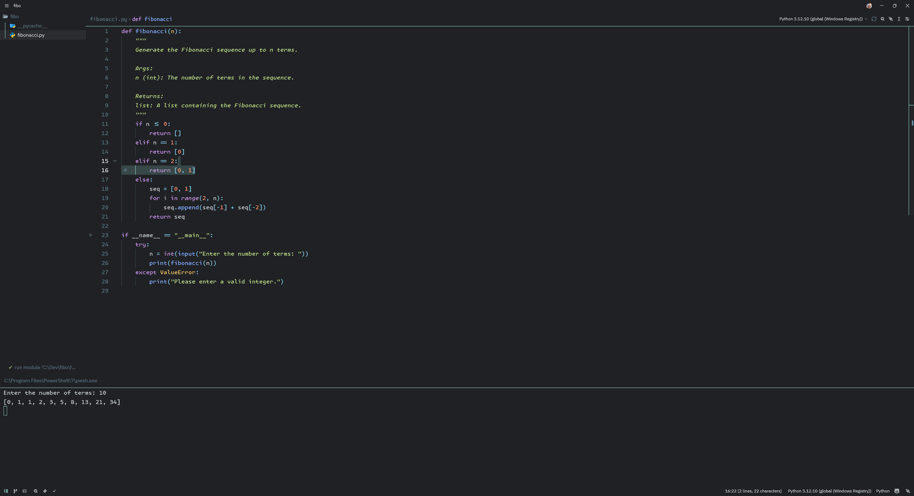
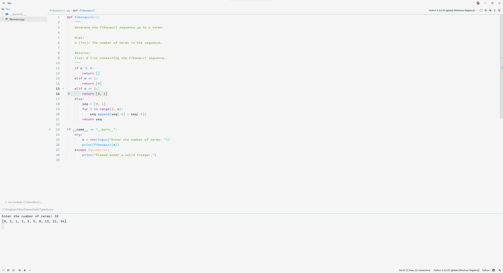
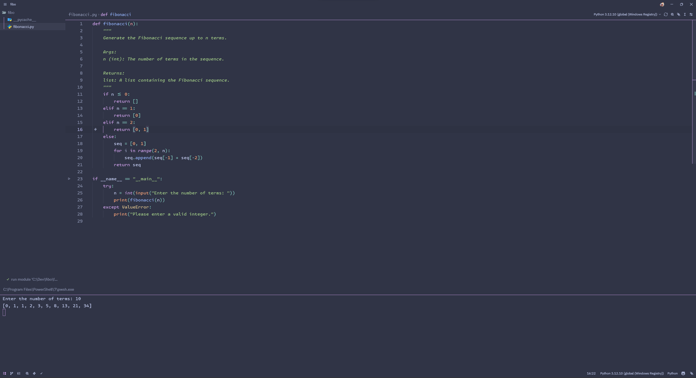

	

# Flat Theme for Zed

A clean, minimalist theme collection for [Zed](https://zed.dev) based on my Flat Theme for VSCode, featuring three readability-tuned variants.

## Themes Included

### Flat Gray (Dark)
The original dark theme with a sleek gray background and teal accents.

    

### Flat Light
A bright, clean light theme perfect for daytime coding.

    

### Flat Frappé (Dark)
Inspired by Catppuccin Frappé, featuring softer, pastel colors for reduced eye strain.

    

## Features

- **Three Purposeful Variants**: Choose between Flat Gray, Flat Light, and Flat Frappé
- **Readability-First Hierarchy**: Clearer separation between chrome, panels, tabs, and editor surfaces
- **Consistent Color Scheme**: Terminal colors match the rest of the IDE in all variants
- **Restrained Flat Design**: Minimal borders without collapsing active and inactive states into the same surface
- **Subtle Accents**: Each theme keeps a signature accent color for focus and feedback
- **Balanced Syntax Highlighting**: Semantic tokens carry the contrast, while punctuation stays quieter

## Color Palettes

Generated from `themes/source-theme.json`.

<!-- GENERATED:palette:start -->
### Flat Gray
- **Background**: `#202124` - base editor canvas
- **Foreground**: `#CFD8DC` - default editor text
- **Accent**: `#94E2D5` - focus and UI feedback
- **Keywords**: `#C792EA` - language keywords
- **Functions**: `#89DDFF` - functions and methods
- **Strings**: `#C3E88D` - strings and text literals
- **Numbers**: `#F78C6C` - numbers and constants
- **Comments**: `#80909A` - comments and doc comments

### Flat Light
- **Background**: `#FAFBFC` - base editor canvas
- **Foreground**: `#31424A` - default editor text
- **Accent**: `#80CBC4` - focus and UI feedback
- **Keywords**: `#8E24AA` - language keywords
- **Functions**: `#1976D2` - functions and methods
- **Strings**: `#5F8F2E` - strings and text literals
- **Numbers**: `#E0642B` - numbers and constants
- **Comments**: `#60727B` - comments and doc comments

### Flat Frappé
- **Background**: `#303446` - base editor canvas
- **Foreground**: `#c6d0f5` - default editor text
- **Accent**: `#ca9ee6` - focus and UI feedback
- **Keywords**: `#ca9ee6` - language keywords
- **Functions**: `#99d1db` - functions and methods
- **Strings**: `#a6d189` - strings and text literals
- **Numbers**: `#ef9f76` - numbers and constants
- **Comments**: `#96A0BE` - comments and doc comments
<!-- GENERATED:palette:end -->

## Installation

### From Zed Extensions

1. Open Zed
2. Press `Cmd+Shift+P` (macOS) or `Ctrl+Shift+P` (Linux/Windows)
3. Type "extensions" and select "zed: extensions"
4. Search for "Flat Theme"
5. Click "Install"

### Manual Installation

1. Clone this repository or download the files
2. In the zed extensions page, select install dev extension
3. Select the folder where you cloned/downloaded the theme
4. Go to Settings → Theme and select your preferred variant:
   - "Flat Gray" (dark)
   - "Flat Light" (light)
   - "Flat Frappé" (dark, pastel)

## What Makes This Different?

These themes focus on a few practical goals:

1. **Readable Hierarchy**: Tabs, panels, title bars, and editor surfaces are separated just enough to make focus states obvious without adding heavy borders.

2. **Terminal Consistency**: All Flat Theme variants keep terminal colors aligned with the editor for a more unified workspace.

3. **Targeted Feedback**: Hover messages, errors, warnings, and info popups keep distinct colored borders so transient UI stays recognizable.

4. **Multiple Aesthetics**: Choose the theme that matches your environment and preference:
   - **Flat Gray**: Neutral dark theme with stronger structure and teal accents
   - **Flat Light**: Bright theme with clearer surface separation and calmer syntax accents
   - **Flat Frappé**: Softer dark theme with pastel tones and improved long-session readability

## Contributing

Contributions are welcome! Please feel free to submit a Pull Request.

## Development

- Rebuild generated files with `python scripts/build_themes.py`
- Verify generated files and contrast checks with `python scripts/build_themes.py --check`

## License

MIT License

## Credits

- Inspired by [Flat Theme for VSCode](https://github.com/Aatricks/flat-theme)
- Border design inspired by [Catppuccin](https://github.com/catppuccin/zed)
- UI philosophy influenced by [Material Theme](https://github.com/material-theme/vsc-material-theme)

## Feedback

If you have suggestions or find issues, please open an issue on GitHub.

## Notes

- Screenshots in this README may lag behind the latest palette tuning. The JSON theme definitions are the source of truth.
